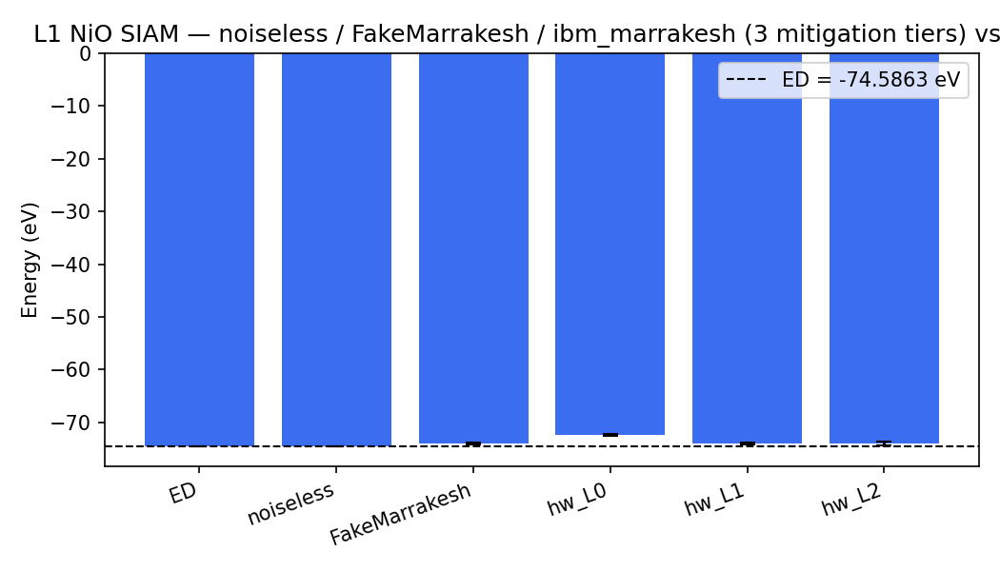

# siam_vqe

Variational Quantum Eigensolver (VQE) for single-impurity Anderson models
(SIAM) in Qiskit, validated against EDRIXS / exact-diagonalization reference
energies, with a hardware path on IBM Quantum.

The package is organized around a ladder of active-space levels:

- **L0** — Hubbard-dimer toy ground state (statevector), the algorithmic smoke test.
- **L1** — minimal NiO SIAM on real IBM Quantum hardware (the `02` notebook).
- **L2 / L3** — noise study and larger active spaces (in progress).

Every level cross-checks the VQE energy against an independent ED/EDRIXS
reference so the quantum result is never trusted on its own.



## Install

```bash
pip install -e ".[dev]"
```

Python 3.11+ required.

## Run

```bash
pytest                      # unit tests
ruff check siam_vqe         # lint
mypy siam_vqe               # types
jupyter lab notebooks/      # driver notebooks
```

## Layout

- `siam_vqe/` — the package (Hamiltonian build, fermion→qubit mappings,
  ansätze, VQE runner, noise model, hardware glue, ED/EDRIXS references)
- `tests/` — pytest suite
- `notebooks/` — driver notebooks per active-space level (L0 toy model,
  L1 NiO minimal hardware run) plus their result JSONs
- `figures/` — versioned result figures

## Reference

Haverkort, Zwierzycki, Andersen, *Phys. Rev. B* **85**, 165113 (2012);
EDRIXS pedagogical examples 3 and 6.

## License

MIT — see [`LICENSE`](LICENSE).
