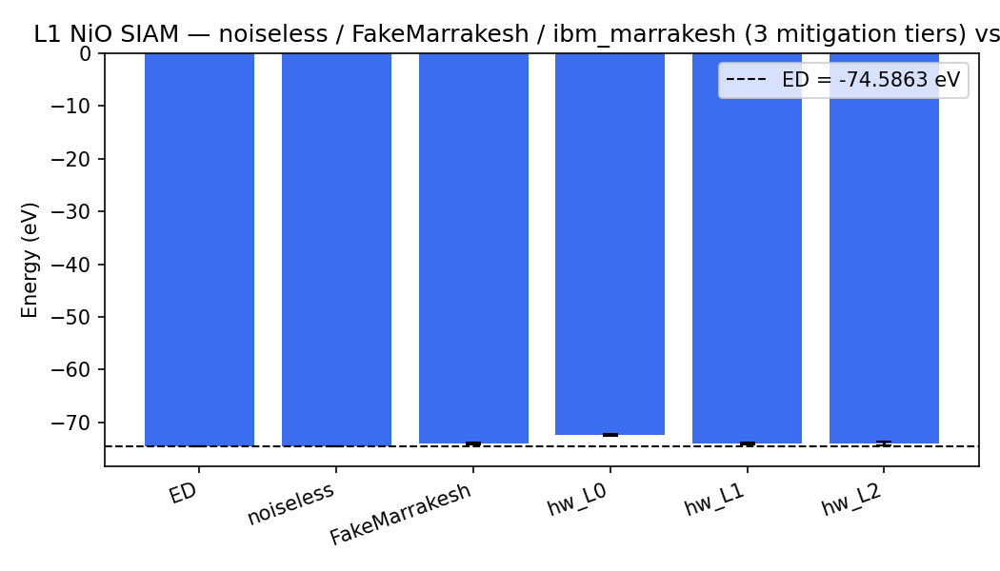

# siam_vqe

Variational Quantum Eigensolver (VQE) for single-impurity Anderson models
(SIAM) in Qiskit, validated against EDRIXS / exact-diagonalization reference
energies, with a hardware path on IBM Quantum.

The package climbs a ladder of active-space levels, adds spectroscopy (qEOM
excited states and L-edge XAS), and ends on a real-hardware execution track.
Every level checks the VQE result against an independent ED/EDRIXS reference,
so a quantum energy is never reported on its own.

| Level | Scope | Qubits | Result |
|---|---|---|---|
| L0 | Hubbard dimer | 2 (tapered) | ΔE = 5.7e-9 |
| L1 | impurity-d + ligand-p, first hardware run | 2 (tapered) | ΔE = 1.1e-12 noiseless |
| L2 | e_g + bath, noise and mitigation study | 6 | M3+ZNE recovers 92% of the gap |
| L3 | full Ni 3d + ligand bath, ADAPT-VQE | 18 | \|ΔE\| = 9.1e-11 |
| Phase 5 | qEOM excited states, L-edge XAS | 18 | L2 distance ≈ 4e-6 vs ED |
| Phase 5b | ISA-correct M3/ZNE on `ibm_marrakesh` | 5 (+anc) | 4/4 ISA-dispatch; noise-dominated |

The full write-up, with methods and every figure, is in
[`reports/siam_vqe_progress_report.md`](reports/siam_vqe_progress_report.md).



## How it works

The pipeline is a set of composable stages, roughly one module each:

- `hamiltonian` / `hamiltonian_l3`: the SIAM second-quantized Hamiltonian —
  impurity d-levels, correlated U (Kanamori or Slater–Condon), and a
  hybridized bath — for a chosen active space.
- `mappings` / `tapering_l3`: fermion-to-qubit encoding and symmetry
  reduction, producing a qubit `SparsePauliOp`.
- `ansatz` / `adapt_vqe`: parameterized trial states. Fixed UCCSD or
  `EfficientSU2` at the small levels; ADAPT-VQE at L3, which grows the ansatz
  operator by operator from a gradient-screened pool.
- `vqe_runner`: the variational loop. A classical optimizer drives a Qiskit
  `Estimator` (statevector, noisy simulator, or real backend) to minimize ⟨H⟩.
- `noise` / `mitigation` / `hardware`: Aer noise models, manual M3 readout
  correction and digital ZNE, and the `qiskit-ibm-runtime` glue
  (transpilation, layout pinning, job submission).
- `core_hole` / `qeom` / `dipole` / `xas`: the spectroscopy path — core-hole
  Hamiltonian, quantum equation-of-motion excitation manifold, cross-sector
  dipole matrix elements, and Lorentzian assembly of the XAS cross-section.
- `reference_ed` / `reference_edrixs` / `reference_l3`: independent
  exact-diagonalization ground states that every VQE result is checked
  against.

Each level must clear a numbered ladder of validation gates: energy match,
state overlap, ansatz expressivity, multistart spread, observable agreement,
and — on the hardware path — a resilience guardrail and a mitigation
effectiveness gate.

## Selected results

**L3 (18 qubits).** ADAPT-VQE selects 7 operators from a 99-operator pool and
lands within 9.1e-11 eV of ED. The occupations reproduce the textbook
³A₂g d⁸ configuration: full t₂g, half-filled e_g.

**L2 mitigation.** Nonlinear ZNE extrapolators clearly beat linear ones. The
best configuration, `m3_zne_poly3_135`, reaches a gap ratio of 0.0755. The
exponential fit is under-determined on three noise points, so poly-3 is the
honest headline.

**Hardware, reported as a negative result.** On `ibm_marrakesh`, all four
mitigation configurations dispatched correctly, but the L1 cross-sector matrix
element collapses from an exact 0.894 to ~0.001–0.005 across every one of
them. Un-mitigated is also ≈0, so this is decoherence at this circuit depth
rather than a mitigation bug — M3 and ZNE do not recover it. A real signal
here needs shallower state preparation and/or dynamical decoupling.

Relatedly, with the EDRIXS charge-transfer levels the L1 ground state is
d²L̄⁰-dominated (⟨n_d⟩ = 1.996, hybridization under 1%), so that hardware run
measured device noise on a near-identity circuit, not Kondo physics.

## Install

```bash
pip install -e ".[dev]"
```

Python 3.12+ required. The project runs on Qiskit 2.x (`qiskit>=2.3`), with
qiskit-nature 0.8, qiskit-algorithms 0.4, and qiskit-ibm-runtime 0.49.

## Run

```bash
pytest                      # unit tests
ruff check siam_vqe         # lint
mypy siam_vqe               # types
jupyter lab notebooks/      # driver notebooks
```

The `scripts/` directory holds the long-running drivers — the L2 noise sweep,
L3 ADAPT production runs, the EDRIXS reference builders, and the hardware
sweep — which are too slow for the notebooks.

## Layout

- `siam_vqe/`: the package
- `tests/`: pytest suite
- `notebooks/`: driver notebooks per level, plus their result JSONs
- `scripts/`: long-running drivers and reference builders
- `figures/`: versioned result figures
- `reports/`: the progress report
- `data/`: cached ED/EDRIXS reference arrays

## Roadmap

- Phase 6: a qEOM RIXS map I(ω_in, ω_loss) via the Kramers–Heisenberg
  cross-section, built from the Phase 5 primitives.
- Reconciling the ~40% spectral-weight gap between the Path-A EDRIXS
  cross-check and the Path-B ED reference.
- An L2 hardware demo.

## Reference

Haverkort, Zwierzycki, Andersen, *Phys. Rev. B* **85**, 165113 (2012);
EDRIXS pedagogical examples 3 and 6.

## License

MIT. See [`LICENSE`](LICENSE).
