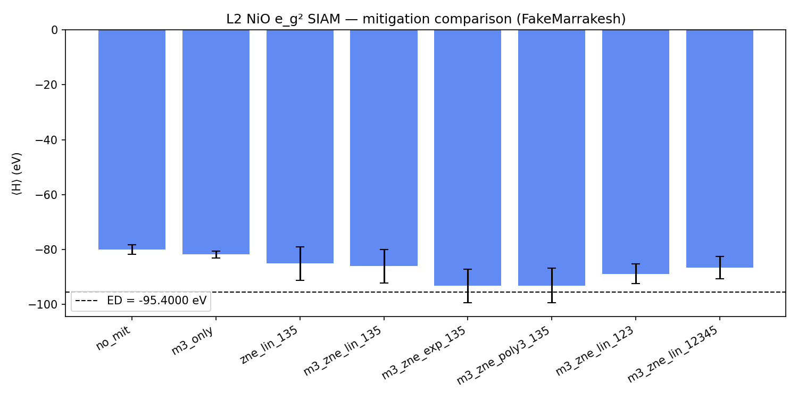
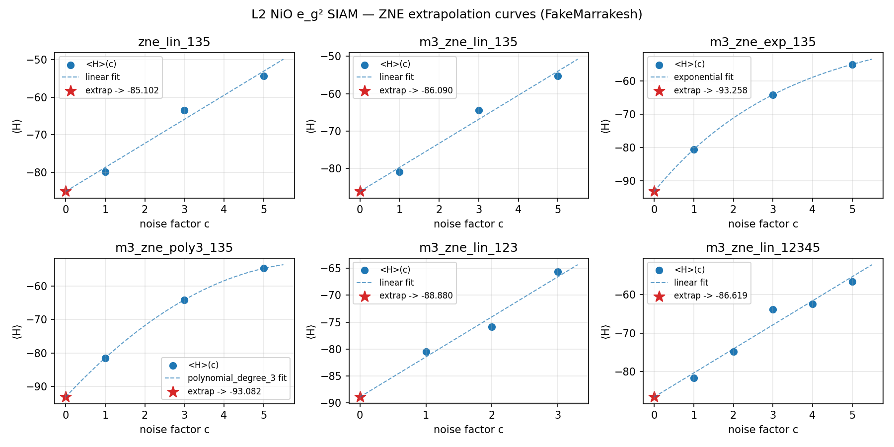
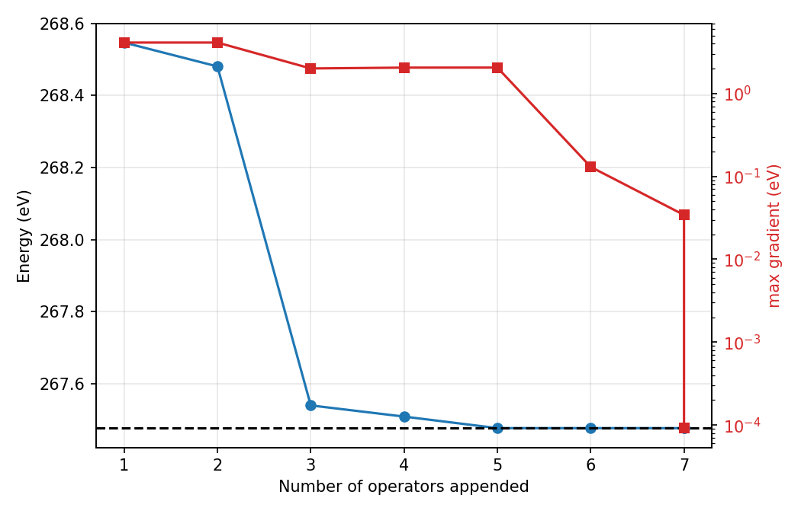
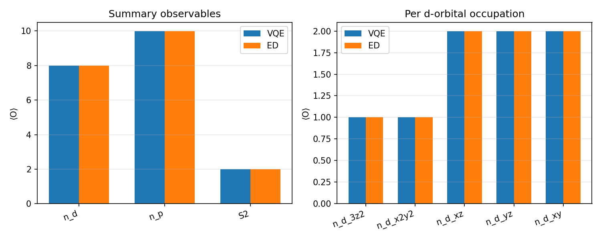
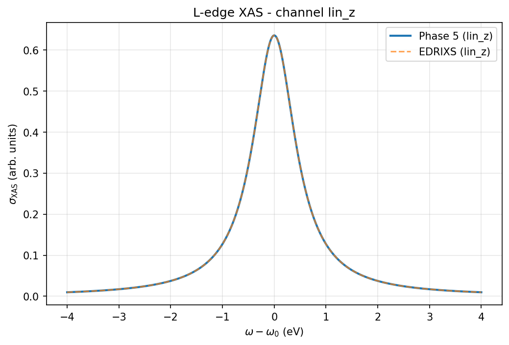
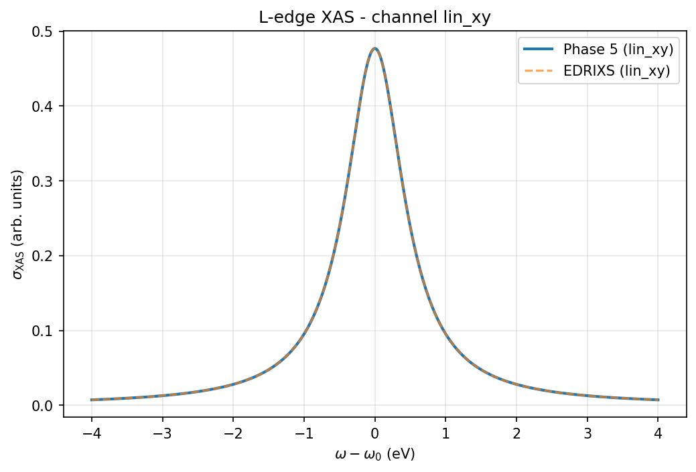
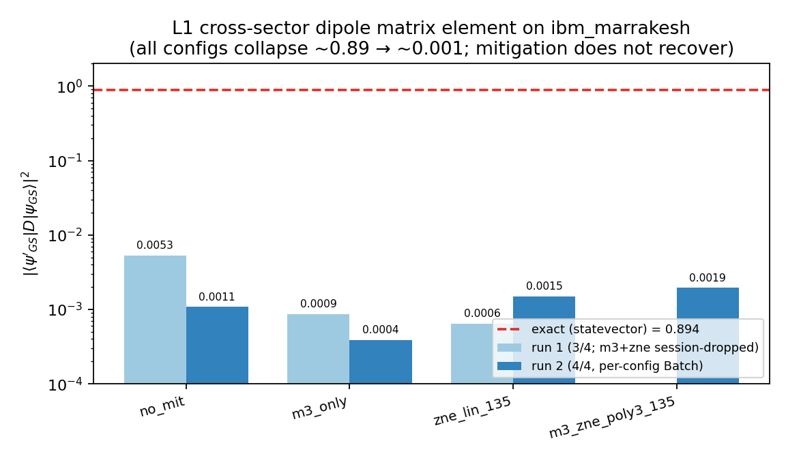

\newpage

# 1. Overview and status

`siam_vqe` is a Qiskit variational-quantum-eigensolver (VQE) study of the NiO
single-impurity Anderson model (SIAM), parameterised from Haverkort *et al.*,
*Phys. Rev. B* **85**, 165113 (2012) / EDRIXS pedagogical examples 3 and 6, and
validated end-to-end against exact diagonalisation (ED). The project climbs an
**active-space ladder L0 → L3**, adds **spectroscopy** (quantum equation-of-motion,
qEOM, and L-edge XAS), and culminates in a **real-hardware execution track** on IBM
Quantum (`ibm_marrakesh`).

Every phase is gated by a fixed **validation-layer framework** (Section 3) and
implemented test-first; the full suite stands at **256 passed / 1 xfailed**.

## 1.1 Phase status

| Phase | Scope | Active space | Qubits | Result | Status |
|---|---|---|---|---|---|
| **1 — L0** | Hubbard dimer | 2 sites × 2 spin | 2 (tapered) | $\Delta E = 5.7\times10^{-9}$ | merged |
| **2 — L1** | impurity-d + ligand-p | 4 spin-orbitals | 2 (tapered) | noiseless $\Delta E=1.1\times10^{-12}$; on hardware | merged |
| **3 — L2** | $e_g$ + bath, noise study | 6 | 6 | M3+ZNE recovers 92% of the gap | merged |
| **4 — L3** | full Ni 3d + ligand bath, ADAPT | 20 spin-orbitals | 18 | $\lvert\Delta E\rvert = 9.1\times10^{-11}$ | merged |
| **5 — qEOM + XAS** | excited states, L-edge XAS | — | 18 | $L_2$ vs ED $\approx 4\times10^{-6}$ | merged |
| **5b — Hardware** | ISA-correct M3/ZNE, real run | 4 | 5 (+anc) | 4/4 ISA-dispatch; noise-dominated | merged |

Repository `liamlts/research-cowork`, package `siam_vqe` (v0.4.0); `main` at merge
commit `648c125c` after PR #4 (Phase 5b) and PR #5 (`_retranslate_to_basis`
Qiskit-2.0 cleanup).

# 2. System and parameters

The model is an Anderson impurity: a correlated Ni 3d shell hybridised with a ligand
bath, with on-site Coulomb (Slater–Condon / Kanamori) interactions and a crystal
field. The L3 (full) Hamiltonian uses EDRIXS example-3 parameters verbatim:

| Parameter | Value (eV) | Meaning |
|---|---|---|
| $F^2_{dd}$ | 9.787 | Slater integral (d–d) |
| $F^4_{dd}$ | 6.078 | Slater integral (d–d) |
| $U_{dd}$ | 7.3 | monopole Coulomb |
| $\Delta$ | 4.7 | charge-transfer energy |
| $V_{e_g}$ | 2.06 | $e_g$ hybridisation |
| $V_{t_{2g}}$ | 1.21 | $t_{2g}$ hybridisation |
| $10Dq$ | 0.56 | cubic crystal field |

Ni $d^8$ + 10 bath electrons = 18 electrons in 20 spin-orbitals; the $(9,9)$
particle sector is tapered to 18 qubits. The reduced levels L0–L2 use consistent
sub-spaces (Section 4).

# 3. Methods and the validation-layer framework

- **Mapping / tapering.** Fermionic operators are Jordan–Wigner mapped; symmetry
  (parity / particle-number) tapering reduces qubit count (e.g. L1: 4 spin-orbitals
  → 2 qubits).
- **Ansätze.** Fixed UCCSD or `EfficientSU2` at the small levels; **ADAPT-VQE** at L3
  (a 99-operator generalised-singles/doubles pool, gradient-screened, threshold
  $10^{-4}$ eV).
- **Reference.** A `scipy.sparse` ED in the same sector is the ground truth ("Path B");
  EDRIXS provides an independent cross-check ("Path A").
- **Error mitigation** (hardware path). Manual M3 readout correction (mthree) +
  digital Zero-Noise Extrapolation (ZNE) by global circuit folding.

Each phase must pass a numbered ladder of checks (pass-or-flag where noted):

1. **Energy match** — $\lvert E_{VQE}-E_{ED}\rvert <$ tol.
2. **State overlap** — $\lvert\langle\psi_{ED}\vert\psi_{VQE}\rangle\rvert^2 \to 1$
   (soft-degeneracy mode if the ED ground state is near-degenerate).
3. **Expressivity** — the ansatz manifold contains the target.
4. **Multistart spread** — convergence across seeds.
5. **Observable agreement** — $\langle n_d\rangle,\langle n_p\rangle,\langle S^2\rangle$, per-orbital occupations.
6. **Resilience guardrail** (hardware, pass-or-flag) — mitigation should not worsen the ED gap.
7. **Mitigation effectiveness** (L2, hard gate) — best config's gap ratio $< 1$.

# 4. Phase L0 — Hubbard dimer (foundation)

A two-site Hubbard dimer ($U=4$, $t=1$, half-filling) on 2 tapered qubits,
`EfficientSU2` (reps 3, 16 parameters), COBYLA. Establishes the package, the
tapering, and the validation harness.

- $E_{VQE} = -0.82842712$, $E_{ED} = -0.82842712$ → **$\Delta E = 5.7\times10^{-9}$**;
  overlap $= 0.99999999$. All five layers pass at near-machine precision.

# 5. Phase L1 — minimal NiO + first hardware

L1 keeps one impurity-d and one ligand-p orbital (4 spin-orbitals → 2 tapered
qubits), $U=7.3$, $V=2.06$, with EDRIXS charge-transfer levels
($\varepsilon_d=-40.85$, $\varepsilon_p=+13.38$).

- **Noiseless:** $E_{VQE}=-74.58626153$ vs $E_{ED}=-74.58626153$ →
  **$\Delta E = 1.1\times10^{-12}$**; multistart spread $1.4\times10^{-8}$. UCCSD needs
  only 3 tiny parameters ($\approx0.04$ rad); the circuit is depth 14 with **2 CZ gates**.
- **Noisy simulator** (`AerSimulator.from_backend(FakeMarrakesh)`):
  $E=-73.97$ ($\sigma=0.15$).
- **Real `ibm_marrakesh`** (2026-05-25): un-mitigated $E=-72.40$ ($\sigma=0.12$),
  M3 $E=-74.04$ ($\sigma=0.13$), M3+ZNE $E=-73.96$ ($\sigma=0.35$).
- **Layer 6 (resilience guardrail): FAILED, honestly reported.** M3 cut the ED gap
  ~4× (2.19 → 0.55 eV) but M3+ZNE made it slightly *worse* (0.55 → 0.62 eV) with a
  3× wider error bar. ZNE on a 2-CZ near-identity circuit is variance-dominated.

**Physics note.** With the EDRIXS charge-transfer levels the $(1,1)$-sector ground
state is $d^2\underline{L}^0$-dominated ($\langle n_d\rangle=1.996$,
$\langle n_p\rangle=0.004$) — essentially both electrons on the impurity,
hybridisation $<1\%$. The hardware run therefore measured device noise on a
near-identity circuit, not Kondo physics; a particle-hole-symmetric gauge would be
needed for a "real Kondo on hardware" demo.

{width=72%}

# 6. Phase L2 — noise study and mitigation grid

L2 opens the $e_g$ + bath active space (6 qubits) and is the dedicated **error-
mitigation study** on a noisy simulator (8192 shots). The Kanamori interaction uses
the **STK Racah convention** ($U=8.595$, $J_H=1.006$, $U'=6.584$ eV), chosen to pin
the $^1A_{1g}$ multiplet gap exactly. ED $=-95.400$; noiseless VQE $=-95.400$.

An 8-configuration mitigation grid (no-mit, M3, ZNE, and M3+ZNE with linear /
exponential / polynomial-degree-3 extrapolators over several noise-factor schedules)
was swept.

- **Layer 6 (passed):** M3+ZNE gap 2.94 eV $\ll$ M3-only gap 14.33 eV.
- **Layer 7 (hard gate, passed):** best config `m3_zne_poly3_135`, gap ratio **0.0755**
  ($\approx$ 92% noise reduction).

| Config (gap ratio, lower = better) | ratio |
|---|---|
| m3_zne_poly3_135 | **0.0755** |
| m3_zne_exp_135 | 0.1947 |
| m3_zne_lin_123 | 0.3373 |
| m3_zne_lin_12345 | 0.5904 |
| m3_zne_lin_135 | 0.6339 |
| zne_lin_135 | 0.6461 |
| m3_only | 0.9500 |

*Finding:* nonlinear extrapolators dominate linear ones; the exponential fit is
under-determined on 3 noise points (poly-3 is the more reliable headline).

{width=70%}

{width=80%}

# 7. Phase L3 — full d-shell ground state via ADAPT-VQE

L3 is the full Ni 3d (5) + ligand bath (5) active space — 20 spin-orbitals, **18
qubits** after tapering — solved with ADAPT-VQE (99-operator pool, gradient threshold
$10^{-4}$ eV, 4 seeds).

- **Result:** $E_{VQE}=267.47700$ vs $E_{ED}=267.47700$ → **$\lvert\Delta E\rvert = 9.1\times10^{-11}$ eV**.
  ADAPT selected **7 operators**; wall time 1543 s; multistart spread 3.08 eV
  (soft-cluster Layer-4 pass — perturbed seeds break the $^3A_{2g}$ symmetry).
- **Observables (all match ED to 8+ decimals):** $\langle n_d\rangle = 8.002$,
  $\langle n_p\rangle = 9.998$; per-orbital $n_{d_{3z^2}}=1.001$, $n_{d_{x^2-y^2}}=1.001$,
  $n_{d_{xz}}=n_{d_{yz}}=2.000$ — the textbook $^3A_{2g}$ $d^8$ configuration
  (full $t_{2g}$, half-filled $e_g$).

The foundation passed an atomic-limit gate first: the impurity-only ED reproduces the
closed-form Racah $d^8$ multiplet spectrum ($^3F,{}^1D,{}^3P,{}^1G,{}^1S$) to $<1$ meV
with the correct $[7,5,3,9,1]$ degeneracies. (Eight plan-level physics bugs were
caught during implementation by the two-stage review loop.)

{width=70%}

{width=70%}

# 8. Phase 5 — qEOM excited states and L-edge XAS

On the L3 ground state, a core hole is introduced ($H' = H + V_{\text{core}}$,
$V_{\text{core}} = -U_{dc}\sum n_d$, $U_{dc}=8.5$ eV); the core-excited state
$\psi'_{GS}$ ($d^9\,{}^2E_g$) is found by ADAPT on $H'$, and **Bauer qEOM** generates
the excitation manifold. The L-edge XAS cross-section is assembled from cross-sector
dipole matrix elements:
$$\sigma_q(\omega) = \sum_F \lvert\langle F\vert D_q\vert\psi_{GS}\rangle\rvert^2 \, \mathcal{L}(\omega;\Gamma=0.5\text{ eV}),\quad q\in\{\text{lin\_z},\text{lin\_xy}\}.$$

- $E_{GS}=267.477$, $E'_{GS}=256.864$ eV; leading peak at $E'_{GS}-E_{GS}=-10.613$ eV
  (shifted to $\omega_0=0$).
- All five validation gates pass on **both** polarisation channels;
  $L_2$ distance vs the Path-B ED reference $\approx 4\times10^{-6}$. Leading-peak
  weights: lin\_z $0.999$, lin\_xy $0.749$.
- A qEOM technicality (Observation #20): an anti-Hermitian (UCC-style) pool makes the
  commutator-metric overlap $S\equiv 0$; the qEOM uses a non-antisymmetric hopping
  pool, decoupled from the ADAPT optimisation pool.
- **Open:** the independent Path-A EDRIXS cross-check (Docker) confirms single-peak
  structure but shows a ~40% spectral-weight gap vs Path B (orbital-channel vs
  photon-polarisation decompositions, spin-resolution, thermal averaging) — deferred
  to v2.

{width=60%}

{width=60%}

# 9. Phase 5b — hardware execution track

The goal of Phase 5b was to run the manual M3 + digital-ZNE spectroscopy stack on
real IBM hardware.

**Task 3e — execution-layer migration.** `backend.run()` is removed in
`qiskit_ibm_runtime` 0.44.1; the entire hardware-reachable path was unified on a
single `_sample_counts(mode, …)` seam over `qiskit_ibm_runtime.SamplerV2`
(`mode in {BackendV2, Batch, Session}`). A real-hardware smoke confirmed dispatch.

**L1 mitigated sweep — ISA-correctness.** `MitigatedEstimator` was made ISA-correct
for an opaque `Batch` (Approach A — *ISA-stable folding*): inputs are ISA-transpiled
inside `run()` with a **pinned layout**, ZNE folding happens at the ISA level (odd
integer factors, barriers, explicit-basis 1-qubit re-translation, connectivity-
asserted), and the hardware path never re-routes — so M3 calibration stays valid
across all per-term Hadamard circuits. A `--configs` driver runs the 4-way
comparison; each config now runs in its **own** Batch with per-config error isolation.

**Real `ibm_marrakesh` result.** All **4/4 configs ISA-dispatched** with no
transpile/Batch errors — the spec's hard success gate (dispatch-correctness) is met.
The **physics is a clean negative result**, confirmed across two runs: the L1
cross-sector matrix element $\lvert\langle\psi'_{GS}\vert D\vert\psi_{GS}\rangle\rvert^2$
collapses from the exact $0.894$ to $\sim0.001$–$0.005$ across *every* config, and
M3 / ZNE / M3+ZNE do **not** recover it. Even un-mitigated is $\approx0$, so this is
decoherence at this circuit depth, not a mitigation bug; the "effectiveness pass" is
degenerate (all ratios $\approx 1.0$, ordering flips run-to-run → noise). Per the
spec, dispatch is gated, agreement is reported.

| config | run 1 $\lvert\text{amp}\rvert^2$ | run 2 $\lvert\text{amp}\rvert^2$ |
|---|---|---|
| no_mit | 0.00527 | 0.00108 |
| m3_only | 0.00087 | 0.00039 |
| zne_lin_135 | 0.00064 | 0.00149 |
| m3_zne_poly3_135 | (session dropped) | 0.00194 |
| **exact** | **0.89380** | **0.89380** |

{width=78%}

**Robustness lesson (run 1 → run 2).** Run 1 dispatched 3/4 then crashed when the
single shared `Batch` session dropped mid-sweep (error 1217, "Session has been
closed", after a connection reset). The fix — a fresh Batch per config + per-config
error isolation — let run 2 complete 4/4 (it even rode out a transient SSL error via
retry). This is a real-hardware-only failure mode; a local `Batch(FakeMarrakesh())`
has no session TTL/network and could not surface it.

# 10. Software, testing, and engineering lessons

- **Package.** `siam_vqe` v0.4.0; modules for each level (`hamiltonian*`, `ansatz`,
  `adapt_vqe`, `qeom`, `noise`, `core_hole`, `dipole`, `xas`, `analysis`,
  reference/tapering helpers) + CLI drivers per level.
- **Tests.** Full suite **256 passed / 1 xfailed**; `ruff` + `mypy` gated in CI
  (package path). Every phase was implemented test-first via subagent-driven
  development with two-stage (spec + code-quality) review.
- **Process lessons captured this cycle** (observation log, for the team's
  research-engineering discipline):
  - Gate shared-module changes on the **full** suite, not just the edited module's
    tests (a regression in a *consumer* test module was missed by per-module runs and
    caught only by the full-suite gate).
  - Read a "must input be in form Y?" discriminator off the component that *enforces*
    Y (the execution `mode`/`Batch`), not a look-alike that merely carries the spec
    (a transpile target's `coupling_map`).
  - Single-instance test fixtures hide cross-instance bugs (a 1-term observable masked
    a multi-term M3 calibration-layout bug); match fixture multiplicity to where state
    is shared.
  - Isolate each unit of a long remote/hardware sweep in its own session + capture
    per-unit errors; one shared session won't survive the whole run.

# 11. Roadmap

- **Qiskit 2.0 migration** — the real fix for the remaining dependency-internal
  deprecations (Pulse package; the `stevedore`/`calc_final_ops` plugin-load log noise
  on hardware runs). Currently silenced via scoped `filterwarnings`.
- **Phase 6 — qEOM RIXS map** $I(\omega_{\text{in}},\omega_{\text{loss}})$ via the
  Kramers–Heisenberg cross-section; the Phase-5 primitives (core hole, dipole, qEOM,
  cross-sector matrix element, Lorentzian assembly) are the inputs.
- **Path-A EDRIXS reconciliation** — resolve the ~40% spectral-weight gap (spin /
  thermal / convention).
- **L2 hardware demo** (Phase 5c).
- **Real signal on hardware** — the L1 observable is decoherence-limited; a future
  attempt needs a shallower state-prep and/or dynamical decoupling.

# Appendix — references

- Haverkort, Zwierzycki, Andersen, *Phys. Rev. B* **85**, 165113 (2012).
- EDRIXS pedagogical examples 3 and 6.
- Repository: `liamlts/research-cowork`, package `siam_vqe`; `main` @ `648c125c`.
- Phase PRs: #1 (L2 noise study), #4 (Phase 5b hardware), #5 (`_retranslate_to_basis`
  Qiskit-2.0 cleanup). Per-phase specs, plans, and closeout notes under
  `siam_vqe/docs/superpowers/`.
